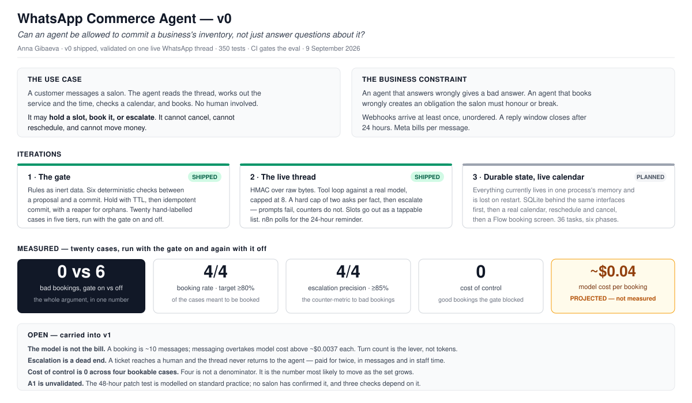
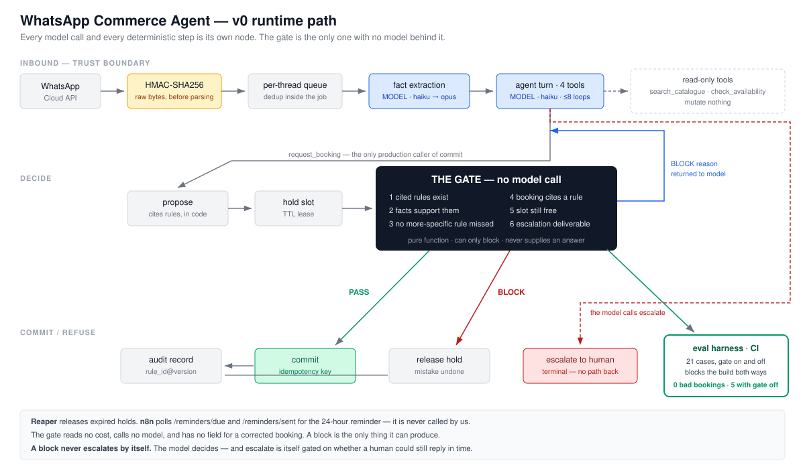

# WhatsApp Commerce Agent v0

## What this is

This is a v0 prototype of a WhatsApp booking assistant for a hair salon. A model reads a customer message and proposes an action. A separate gate, built from a written rule set and calendar state, checks that proposal before anything happens and can only say no. The prototype includes twenty test cases that exercise the rules, a two-phase booking flow with a hold and an idempotent commit, and a webhook receiver for a real WhatsApp thread.



## The runtime path

Every model call and every deterministic step is its own node. The gate is the only one with no model behind it.



Both diagrams are also a two-slide deck: [`docs/img/wca-v0.pptx`](docs/img/wca-v0.pptx).

## How to run it

Every command below was run against this checkout before being written down.

```bash
uv sync --extra dev
uv run pytest
uv run wca cases
uv run wca cases --gate-off
uv run wca rules
```

`uv run pytest` runs the test suite. `uv run wca cases` runs the twenty cases with the gate on. `uv run wca cases --gate-off` runs the same twenty cases with the gate switched off, for comparison. `uv run wca rules` prints the five rules in the policy file in plain English.

Two more subcommands exist for the live WhatsApp thread, covered in [docs/live-thread-runbook.md](docs/live-thread-runbook.md): `uv run wca send --to <number> --text <text>` sends one message, and `uv run wca serve` runs the webhook receiver.

## What it demonstrates

**Rules as data, no code execution.** `policy/salon.rules.json` holds five rules as JSON: a condition, an outcome, and the source sentence each rule came from. `wca rules` reads that file and prints each rule's condition in English. Nothing in the rule file is executed as code. Changing a rule means editing JSON, not editing Python.

**A missing fact is not a no.** When a fact a rule needs was never established, the proposer asks the customer instead of guessing, and the gate treats an unknown, more-specific rule as reason to block rather than as permission to proceed. Test case `unanswerable_01` in `cases/v0.cases.json` exercises this: whether the visit is a first colour visit was never established, and both the proposer and the gate block the booking on that gap. `wca cases` shows this case passing.

**The gate calls no model and can only block.** `src/wca/gate.py` imports only `models`, `rules`, and read-only views of the calendar and the escalation window. It never imports `extract`, `transport`, or `conversation`, so it cannot reach a model call, and `Verdict` has no field for a corrected booking, so a block is the only thing the gate can produce. `tests/test_gate_purity.py` checks the import graph directly.

**An unmet lead-time requirement blocks a booking.** `policy/salon.rules.json` requires a 48-hour patch test before a first colour appointment. Case `override_01` proposes a first colour visit 20 hours out. The gate blocks it at check 4 (`booking_cites_rule`) because the cited rule's 48-hour requirement is unmet. The same customer 120 hours out books. Both were re-verified directly against `gate.evaluate` outside the case harness, along with a version of the same case where `hours_until_appointment` is left out of the facts entirely, which also blocks.

**Two-phase booking with an idempotent commit.** Booking a slot takes a hold, then a commit. `MockCalendar.hold` refuses a second hold on an already-held or already-booked slot. `MockCalendar.commit` takes an idempotency key: committing twice with the same key returns the same booking instead of creating a second one. This was re-verified directly: holding a slot and committing it twice with one idempotency key produced exactly one booking.

**The escalation deadline.** A customer message opens a 24-hour reply window. `window_view` reports whether an escalation can still reach a human, using the margin in `wca/escalation.py` (`ESCALATION_MARGIN_HOURS = 2`). At hour 2 of the window it reports deliverable. At hour 23, with only about an hour of margin left, it reports not deliverable. This was re-verified directly with a `SimulatedClock` moved by hand to hour 2 and hour 23 of the same window.

Also verified directly: a hold past its TTL is cleared by the reaper (`MockCalendar.expire_due`) and the slot can be held again, and `gate.evaluate` called twice with identical arguments returns equal verdicts.

## When the gate counts as working

Two numbers decide it, and both directions have to hold:

> **`wca cases` must report 0 bad bookings, and `wca cases --gate-off` must report at least one.**

The second half is the one worth stating. Zero bad bookings with the gate on proves nothing on its own — a case set where every booking is obviously fine produces the same zero. The gate is only shown to be doing work if removing it lets something through. If `--gate-off` ever reports zero, the cases have stopped exercising the gate, and that is a failure of the test set even though it reads like success.

CI enforces both directions on every push, so neither can drift quietly. Today the numbers are 0 and 6.

This rule was written on 9 September 2026, after v0's runs, so it binds changes from here rather than validating what has already been measured. The KPI targets in PRD §7 were set before any run and are the ones that carry that weight.

## What it does not demonstrate

| Claim | Why not |
|---|---|
| These percentages hold at volume | Twenty cases. One case moves a percentage by five points. Counts are printed, not rates. The targets point in a direction, nothing more. |
| Salons require a 48-hour patch test | This is PRD assumption A1, based on standard practice and not confirmed with any salon. Check 3, the override cases, and the main demo all depend on it. |
| The test cases match real salon policy | The cases were written and reviewed, not observed. This is PRD assumption A3. |
| Escalations expire in practice | PRD assumption A2 is unmeasured. The simulated clock proves the mechanism works. It says nothing about how often escalations actually time out in the field. |
| Policy in other industries is rule-shaped | PRD assumption A4 is untested, and it is the assumption that would hurt most if it turns out false. |
| This works on WhatsApp at scale | One live conversation shows the path works once. It does not test two customers at the same time, retry storms, a rejected template, or quality-rating throttling. |
| Check 6 predicts what Meta will do | It checks time left in the window and template approval. Meta also weighs quality rating and frequency caps, which are not visible to this code. A send that fails after check 6 passed is a finding, not a bug, and the audit record is written so that can be seen when it happens. |

The live WhatsApp thread described in `docs/live-thread-runbook.md` **has** been run, once, on 9 September 2026 — messages went in and out over a real WhatsApp number from this codebase. One conversation shows the path works once. It says nothing about two customers at the same time, a redelivery storm, a rejected template, or quality-rating throttling.

## A note on the test data

`cases/v0.cases.json` was written and reviewed by hand. It was not observed in a real salon, and none of the twenty cases came from an actual customer conversation. The assumption behind several of them, that salons require a 48-hour patch test before a first colour appointment, is PRD assumption A1 and is unconfirmed.

## Test count

`uv run pytest -q` reports 350 passed as of 9 September 2026. CI runs the same command on every push, along with both directions of the gate check above.
