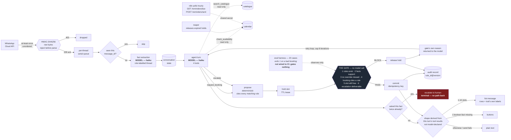

# WhatsApp Commerce Agent

*Can an agent be allowed to commit a business's inventory, not just answer questions about it?*

**Anna Gibaeva** · v0 shipped and validated on a live WhatsApp thread · 350 tests · 9 September 2026

---

## Page 1 — Summary

### The use case

A customer messages a salon on WhatsApp. The agent reads the thread, works out what service
they want and when, checks a calendar, and books the appointment. No human involved.

One turn: inbound message → fact extraction → agent turn with four tools → for a booking,
hold the slot, run the gate, commit on PASS or release on BLOCK → reply.

**What the agent is allowed to do on the customer's behalf:** hold a slot, book it, escalate to
a human. It cannot cancel, cannot reschedule, and cannot move money. The deposit rule fires and
stops short of collecting.

### The business constraint

An agent that answers a question wrongly gives a bad answer. An agent that books wrongly creates
an obligation the salon has to honour or break.

Three platform facts shape the build:

- **Webhooks arrive at least once, in no guaranteed order.** A redelivery could book twice. Dedup
  on message id, idempotency key on commit, one serial queue per thread.
- **A customer message opens a 24-hour reply window.** Outside it, only an approved template
  sends. An escalation raised at hour 23 produces a human reply that cannot be delivered.
- **Billing is per message, and from 1 October 2026 in-window utility messages bill too.** An
  agent that asks six questions costs more than one that asks two.

### Iterations

**Iteration 1 — the gate.** `SHIPPED`
Rules as inert data, evaluated by a closed operator set. Six deterministic checks between a
proposal and a commit. Two-phase booking: hold with TTL, then idempotent commit, with a reaper
for orphans. Twenty hand-labelled cases in five tiers, run with the gate on and off.

**Iteration 2 — the live thread.** `SHIPPED`
WhatsApp Cloud API transport with HMAC-SHA256 signature verification over raw bytes. Tool loop
against a real model, capped at 8 iterations. Fact extraction from role-labelled history. A hard
cap of two asks per fact, then escalate — because prompts fail and counters do not. n8n polls two
endpoints for the 24-hour reminder hop. Slots go out as a WhatsApp list and yes/no questions as
buttons, with the shape derived in code from what the tools actually returned — the model has no
way to declare it.

**Iteration 3 — durable state and a live calendar.** `PLANNED`
Everything currently lives in one process's memory and is lost on restart. SQLite behind the same
interfaces first, then a real calendar, then reschedule and cancel, then a Flow booking screen.
Planned in `docs/superpowers/plans/2026-09-09-wca-v1.md`.

### The table

| Iter. | Cost & latency factors | Optimizations | Guardrails | Eval metrics |
|---|---|---|---|---|
| **1 — the gate** | Gate makes **no model call**, so the decision path costs nothing per proposal. Latency **not measured**. | Rules evaluated as data, not code. Specificity derived from `requires_facts`, not declared. | Six checks. Absolute veto: `deny` and `require_escalation` block against all matching rules, TRUE and UNKNOWN. Blocks labelled *grounding* or *conclusion*. | **MEASURED —** bad bookings 0/20 gate on, 6/20 gate off. Booking rate 4/4. Escalation precision 4/4. Cost of control 0. |
| **2 — the live thread** | 2 model calls per turn: extraction (haiku) + agent turn with tools (haiku, ≤8 iterations). Extraction, retry and agent-call cost all priced and carried to the audit record. **Not yet measured against real traffic.** | History capped at N turns. Message budget 20/hour/thread. Slot labels precomputed in code so the model never does clock arithmetic. Buttons and lists cut turns by replacing typed answers with taps. | HMAC over raw bytes, rejected before parsing. Dedup inside the queued job, not at the edge. Two-asks-per-fact cap then escalate. Shared-secret auth on both n8n endpoints, closed when unset. Interactive shape derived from tool results, never model-declared. | **MEASURED —** 350 tests green. Live thread completed end to end. **NOT MEASURED —** live latency, cost per resolved booking, real-traffic accuracy. |
| **3 — durable state** | **PROJECTED —** SQLite adds a write per turn; a live calendar adds a network read inside the gate's synchronous path. | **PROJECTED —** hold ledger in front of the external calendar, since no real calendar API offers a lease. | **PROJECTED —** `view()` must be a live read every call or gate check 5 stops catching external double-bookings. Every new inbound surface must terminate in the same propose → evaluate → commit path. | **PROJECTED —** no numbers exist. Nothing here has been run. |

### Open items

**Closed on 9 September**, each with a test that fails if the fix is removed:

- **Model tiering was declared and not implemented.** `LARGE_MODEL` and a `PRICES` table existed
  and nothing selected the large model. Now real: haiku first, one retry on opus when extraction
  fails to parse, capped at two attempts.
- **The eval gated nothing.** CI now runs the cases on every push and fails the build in both
  directions — a case set that stops exercising the gate fails rather than looking like success.
- **No written rule for "the gate is working."** Stated in the README: 0 bad bookings with the
  gate on, at least one with it off. Recorded as written *after* v0's runs, so it binds what
  comes next rather than blessing what already happened.
- **Attempts were not logged**, so a first-pass extraction and a retried one were the same
  number. `model` and `attempts` now ride on every extraction result.
- **The audit log silently dropped almost everything.** `proposal_id` was `prop_0001` for every
  turn on every thread, and `AuditLog.append` dedups on it — so after the first booking in a
  process, every later record was discarded. Found while checking whether this page could
  honestly draw an audit box. Two threads booking now produce two records; before the fix, one.

**Still open:**

1. **Cost per booking is measurable but not measured.** Extraction cost, agent-call cost and the
   turn total now reach the audit record. Nothing has been run against real traffic, so every
   figure here remains a model.
2. **The model is not the bill.** A booking is roughly ten messages, and messaging cost overtakes
   model cost above about $0.0037 per message — below published WhatsApp utility rates in
   essentially every market. Turn count is the cost lever, not tokens. Nothing counts messages yet.
3. **The gate sees one proposal, never the trajectory.** An action split into two individually
   legal steps would not be caught. This is the substance of Phase 7.
4. **Escalation is a dead end.** A ticket is raised and its deadline monitored. Nothing resumes the
   thread afterwards, and there is no path from human back to agent.
5. **Cost of control is 0 over four bookable cases.** Four is too few to claim the gate costs
   nothing. This is the number most likely to move as the case set grows.
6. **Escalation precision is gameable by the loop guard.** The two-ask cap converts extractor
   failures into escalations. A worse extractor therefore produces a better precision number.
7. **A1 unvalidated.** The 48-hour patch test rule is modelled on standard practice. No salon has
   confirmed it, and three checks depend on it.

---

## Page 2 — Architecture

**Reading the diagram.**

The gate is the only node with no model behind it. Same code path gates live traffic and scores
the offline test set, so the tests measure what actually runs.

**The loop is real, and it is turn-scoped.** Both halves of that matter.

Real: the model chooses which of four tools to call and in what order — no fixed sequence exists
in code. `run_turn` loops while the model keeps calling tools, up to 8. Each iteration sees what
the previous ones returned, including the gate's own block reason, so a refused booking can
become a question or a different slot rather than a blind retry. Two of the tools change real
state. Those are the four properties that separate an agent from a pipeline, and they hold.

Turn-scoped: there is no plan the model writes down, nothing survives a process restart, and the
gate sees one proposal — never the trajectory that produced it. So a goal pursued across two
turns is invisible to it, and an action split into two individually-legal steps would not be
caught. Closing that is Phase 7 of the v1 plan, not something v0 does.

The honest claim is "plan-and-act within a turn, under a deterministic gate." Not "agentic",
unqualified.

The eval harness is drawn **solid** because it blocks. CI runs the twenty cases on every push and
fails the build in both directions — no bad bookings with the gate on, and bad bookings still
getting through with it off. Until 9 September it would have had to be dashed: the harness
returned a failure code and nothing read it.

Escalation is drawn in red because it is terminal. Once a thread escalates, nothing brings it back.

The reply shape is a diamond, not a model output. Nothing the model says selects it: the branch is
recomputed each turn from the tool calls that actually ran and the facts still missing. A model
that wanted to force a list with no slots behind it has no lever to pull, and every branch carries
the same reply text — the envelope changes, the words do not.

Every model node says **haiku** because every model call is haiku. There is no tiering in the
runtime path, whatever the constants say.

### Iterations on the flow

| Iteration | Where it lives on the diagram |
|---|---|
| **1 — the gate** | `propose → hold → GATE → commit/release → audit`, plus the reaper |
| **2 — the live thread** | Everything left of `propose`: signature, queue, dedup, extraction, the agent's tool loop and its retry edge — plus the n8n poll |
| **3 — durable state** | Replaces every cylinder with a persisted store, and puts a hold ledger between `hold` and a real calendar |
