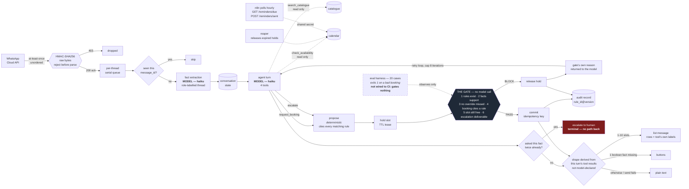

# WhatsApp Commerce Agent

*Can an agent be allowed to commit a business's inventory, not just answer questions about it?*

**Anna Gibaeva** · v0 shipped and validated on a live WhatsApp thread · 327 tests · 9 September 2026

---

## Page 1 — Summary

### The use case

A customer messages a salon on WhatsApp. The agent reads the thread, works out what service
they want and when, checks a calendar, and books the appointment. No human involved.

One turn: inbound message → fact extraction → agent turn with four tools → for a booking,
hold the slot, run the gate, commit on PASS or release on BLOCK → reply.

**What the agent is allowed to do on the customer's behalf:** hold a slot, book it, escalate to
a human. It cannot cancel, cannot reschedule, and cannot move money. The deposit rule fires and
stops short of collecting.

### The business constraint

An agent that answers a question wrongly gives a bad answer. An agent that books wrongly creates
an obligation the salon has to honour or break.

Three platform facts shape the build:

- **Webhooks arrive at least once, in no guaranteed order.** A redelivery could book twice. Dedup
  on message id, idempotency key on commit, one serial queue per thread.
- **A customer message opens a 24-hour reply window.** Outside it, only an approved template
  sends. An escalation raised at hour 23 produces a human reply that cannot be delivered.
- **Billing is per message, and from 1 October 2026 in-window utility messages bill too.** An
  agent that asks six questions costs more than one that asks two.

### Iterations

**Iteration 1 — the gate.** `SHIPPED`
Rules as inert data, evaluated by a closed operator set. Six deterministic checks between a
proposal and a commit. Two-phase booking: hold with TTL, then idempotent commit, with a reaper
for orphans. Twenty hand-labelled cases in five tiers, run with the gate on and off.

**Iteration 2 — the live thread.** `SHIPPED`
WhatsApp Cloud API transport with HMAC-SHA256 signature verification over raw bytes. Tool loop
against a real model, capped at 8 iterations. Fact extraction from role-labelled history. A hard
cap of two asks per fact, then escalate — because prompts fail and counters do not. n8n polls two
endpoints for the 24-hour reminder hop. Slots go out as a WhatsApp list and yes/no questions as
buttons, with the shape derived in code from what the tools actually returned — the model has no
way to declare it.

**Iteration 3 — durable state and a live calendar.** `PLANNED`
Everything currently lives in one process's memory and is lost on restart. SQLite behind the same
interfaces first, then a real calendar, then reschedule and cancel, then a Flow booking screen.
Planned in `docs/superpowers/plans/2026-09-09-wca-v1.md`.

### The table

| Iter. | Cost & latency factors | Optimizations | Guardrails | Eval metrics |
|---|---|---|---|---|
| **1 — the gate** | Gate makes **no model call**, so the decision path costs nothing per proposal. Latency **not measured**. | Rules evaluated as data, not code. Specificity derived from `requires_facts`, not declared. | Six checks. Absolute veto: `deny` and `require_escalation` block against all matching rules, TRUE and UNKNOWN. Blocks labelled *grounding* or *conclusion*. | **MEASURED —** bad bookings 0/20 gate on, 6/20 gate off. Booking rate 4/4. Escalation precision 4/4. Cost of control 0. |
| **2 — the live thread** | 2 model calls per turn: extraction (haiku) + agent turn with tools (haiku, ≤8 iterations). Token usage captured on extraction only. **Cost per booking not computed.** | History capped at N turns. Message budget 20/hour/thread. Slot labels precomputed in code so the model never does clock arithmetic. Buttons and lists cut turns by replacing typed answers with taps. | HMAC over raw bytes, rejected before parsing. Dedup inside the queued job, not at the edge. Two-asks-per-fact cap then escalate. Shared-secret auth on both n8n endpoints, closed when unset. Interactive shape derived from tool results, never model-declared. | **MEASURED —** 327 tests green. Live thread completed end to end. **NOT MEASURED —** live latency, cost per resolved booking, real-traffic accuracy. |
| **3 — durable state** | **PROJECTED —** SQLite adds a write per turn; a live calendar adds a network read inside the gate's synchronous path. | **PROJECTED —** hold ledger in front of the external calendar, since no real calendar API offers a lease. | **PROJECTED —** `view()` must be a live read every call or gate check 5 stops catching external double-bookings. Every new inbound surface must terminate in the same propose → evaluate → commit path. | **PROJECTED —** no numbers exist. Nothing here has been run. |

### Open items

1. **Model tiering is declared and not implemented.** `LARGE_MODEL` and a `PRICES` table exist in
   `extract/anthropic.py`. No code path selects the large model; nothing multiplies tokens by
   prices. Every call is haiku. Either wire the escalation and the cost calculation, or delete
   both constants — right now the repo asserts a cost architecture it does not have.
2. **The eval gates nothing.** `wca cases` exits 1 on a bad booking, but there is no CI, so no
   regression fails anything. One workflow file turns a dashboard into a gate.
3. **Cost per resolved booking cannot be computed.** Extraction tokens are captured on
   `ExtractionResult` and never summed. The agent's tool call captures no usage at all, and the
   tool-loop iteration count is a local variable that never reaches the audit record.
4. **No pre-registered rule for whether the gate is working.** The KPI targets were written before
   the runs, which is right. The gate-on/gate-off comparison was not given a threshold — "published
   with counts" is honest but decides nothing.
5. **Escalation is a dead end.** A ticket is raised and its deadline monitored. Nothing resumes the
   thread afterwards, and there is no path from human back to agent.
6. **Cost of control is 0 over four bookable cases.** Four is too few to claim the gate costs
   nothing. This is the number most likely to move as the case set grows.
7. **Escalation precision is gameable by the loop guard.** The two-ask cap converts extractor
   failures into escalations. Those count as escalations the agent raised; whether they "genuinely
   needed a human" is arguable, since a better extractor would not have needed one.
8. **A1 unvalidated.** The 48-hour patch test rule is modelled on standard practice. No salon has
   confirmed it.

---

## Page 2 — Architecture

**Reading the diagram.**

The gate is the only node with no model behind it. Same code path gates live traffic and scores
the offline test set, so the tests measure what actually runs.

The retry loop is real: a BLOCK returns the gate's own reason text to the model, which can ask a
question or try a different slot, capped at 8 tool iterations. That is what makes this an agent
rather than a validated pipeline.

The eval harness is drawn **dashed** on purpose. It has a gate's exit code and no CI behind it,
so it observes and does not block. Wire it to CI and this becomes a solid line — the single
cheapest change in the build.

Escalation is drawn in red because it is terminal. Once a thread escalates, nothing brings it back.

The reply shape is a diamond, not a model output. Nothing the model says selects it: the branch is
recomputed each turn from the tool calls that actually ran and the facts still missing. A model
that wanted to force a list with no slots behind it has no lever to pull, and every branch carries
the same reply text — the envelope changes, the words do not.

Every model node says **haiku** because every model call is haiku. There is no tiering in the
runtime path, whatever the constants say.

### Iterations on the flow

| Iteration | Where it lives on the diagram |
|---|---|
| **1 — the gate** | `propose → hold → GATE → commit/release → audit`, plus the reaper |
| **2 — the live thread** | Everything left of `propose`: signature, queue, dedup, extraction, the agent's tool loop and its retry edge — plus the n8n poll |
| **3 — durable state** | Replaces every cylinder with a persisted store, and puts a hold ledger between `hold` and a real calendar |
